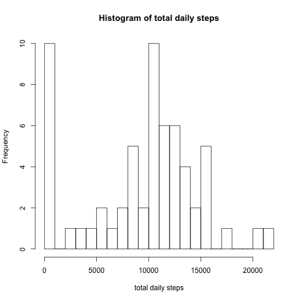
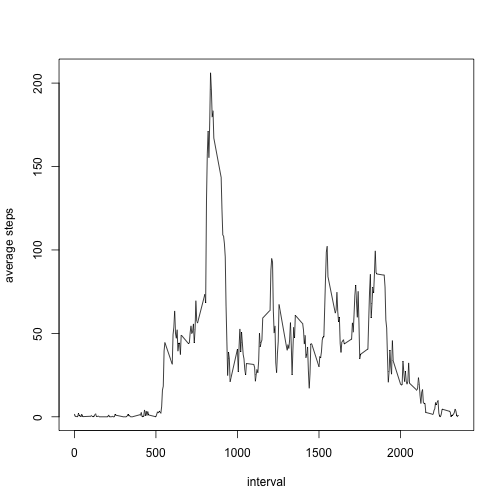
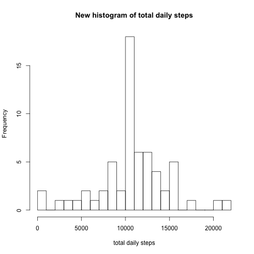
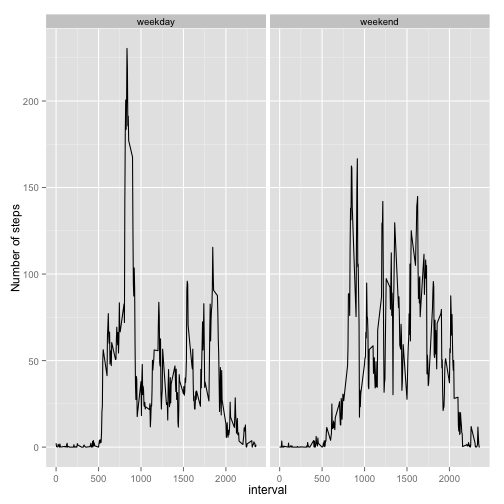

This is a report for the analysis of the data from a personal activity monitoring device. This device collects data at 5 minute intervals through out the day. The data consists of two months of data from an anonymous individual collected during the months of October and November, 2012 and include the number of steps taken in 5 minute intervals each day.

The analysis will be divided into the following parts:


```r
require(knitr)
opts_chunk$set(echo=TRUE, warning=FALSE, message=FALSE, cache=FALSE) #enrivonmental setting
```

## Loading and preprocessing the data

```r
activity <- read.csv("activity.csv", header = T, na.strings = "NA")
activity$date <- as.Date(activity$date, "%Y-%m-%d") # transform the date object
```


## What is mean total number of steps taken per day?

```r
require(dplyr) ## load required library

## Calculate the total number of steps taken per day
total_daily <- activity %>% group_by(date) %>% summarise(daily_steps = sum(steps, na.rm = T))  

## Make a histogram of the total number of steps taken each day
with(total_daily, hist(daily_steps, breaks = 20, xlab = "total daily steps", main = "Histogram of total daily steps"))
```

 

```r
## Calculate and report the mean and median of the total number of steps taken per day
mean <- mean(total_daily$daily_steps)
med <- median(total_daily$daily_steps)
```
The mean of the total number of steps taken per day is 9354.2295082, and the median is 10395.


## What is the average daily activity pattern?

```r
## calculate the average mean steps towards 5-min interval
interval_step <- activity %>% group_by(interval) %>% summarise(ave_steps = mean(steps, na.rm = T))

## Make a time series plot of the 5-minute interval (x-axis) and the average number of steps taken, averaged across all days (y-axis)
with(interval_step, plot(ave_steps ~ interval, type = "l", ylab = "average steps"))
```

 

```r
## Which 5-minute interval, on average across all the days in the dataset, contains the maximum number of steps?
max_int <- interval_step[which.max(interval_step$ave_steps),1]
```
Interval 835 contains the maxium number of steps on average across all the days.

## Imputing missing values
Note that there are a number of days/intervals where there are missing values. The presence of missing days may introduce bias into some calculations or summaries of the data.


```r
## Calculate and report the total number of missing values in the dataset
na_row <- sum(!complete.cases(activity))
```
There are 2304 rows with missing values in the dataset.

Stragety to fill in the NA missing values: replace NA with the mean value of that 5-minute interval across all days.


```r
## Create a new dataset that is equal to the original dataset but with the missing data filled in.
interval_step <- transform(interval_step, interval = as.factor(interval))
activity_new <- activity # copy to a new dataset
activity_new$steps[!complete.cases(activity)] <- interval_step[as.factor(activity$interval[!complete.cases(activity)]), "ave_steps"]

## calculate new total number of steps taken each day
total_daily_new <- activity_new %>% group_by(date) %>% summarise(daily_steps = sum(steps)) 

## Make a histogram of the total number of steps taken each day
hist(total_daily_new$daily_steps, breaks = 20, xlab = "total daily steps", main = "New histogram of total daily steps")
```

 

```r
## Calculate and report the mean and median of the total number of steps taken per day
mean_new <- mean(total_daily_new$daily_steps)
med_new <- median(total_daily_new$daily_steps)
```
The original data has been filled in with NA replaced by average value of the interval. The mean of the new total number of steps taken per day is 1.0766189 &times; 10<sup>4</sup>, and the median is 1.0766189 &times; 10<sup>4</sup>. These value differ from mean and median values of estimations with NA ignored, which are 9354.2295082 and 10395, respectively.

The imputing of missing values can reduce the bias of the data and make data more reliable.

## Are there differences in activity patterns between weekdays and weekends?

```r
## Create a new factor variable in the dataset with two levels – “weekday” and “weekend” indicating whether a given date is a weekday or weekend day.

week_day_end <- function(x) {
    if (x == "Mon" | x == "Tue" | x == "Wed" | x == "Thu" | x == "Fri") return ("weekday")
    else return ("weekend")
}  ## a short function transforms weekdays into weekday/weekend

activity_new$wkday <- as.factor(sapply((weekdays(activity_new$date, abbreviate = T)), week_day_end))

## Make a panel plot containing a time series plot (i.e. type = "l") of the 5-minute interval (x-axis) and the average number of steps taken, averaged across all weekday days or weekend days (y-axis).
interval_wkday <- activity_new %>% group_by(interval, wkday) %>% summarise(ave_steps = mean(steps))

require(ggplot2)
## plotting with ggplot2 system
qplot(interval, ave_steps, data = interval_wkday, facets = .~wkday, geom = "line", ylab = "Number of steps")
```

 
